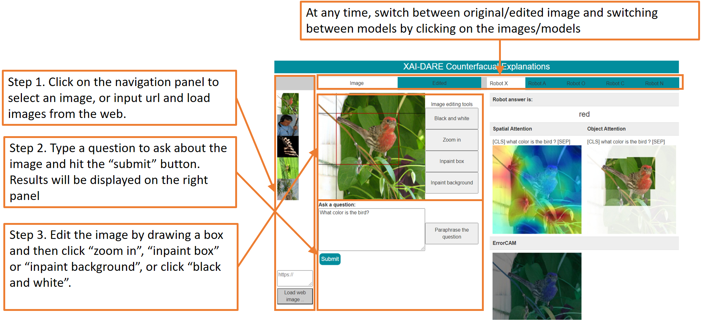
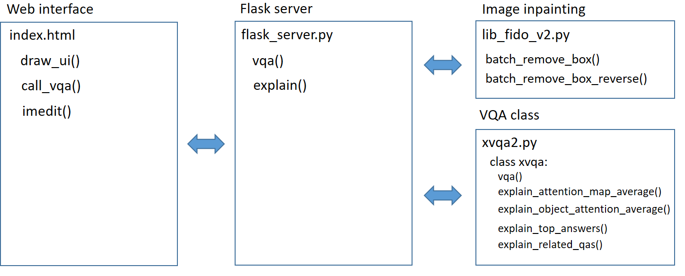

# Explainable VQA with SOBERT 

This repository provides source code and data for building a docker container to demo several capabilities of the Spatial-Object Attention BERT (SOBERT) Visual Question Answering (VQA) model with BERT and ErrorCam attention maps. 

## How to use

### Prerequisites

- Docker with GPU capabilities is required to build and run the docker image. 
- The compiled docker will take about 20GB of disk space. 
- GPU with >20GB of GRAM is required to run this demo.
- Obtain dependency libraries from https://github.com/zzzace2000/FIDO-saliency/ and https://github.com/zzzace2000/generative_inpainting. Please review the license terms of the respective libraries before downloading. 
- Download pretrained SOBERT-VQA ([link](https://www.dropbox.com/s/satczbns26q5nfa/sobert_vqa_models.zip?dl=0)) and ErrorCam (([link](https://www.dropbox.com/s/n06utaqo5ftusbn/errorcam_checkpoints.zip?dl=0))) checkpoints. The 

We have prepared script `./script_dep_data.sh` for downloading the checkpoints and obtaining the dependency libraries.

### Building docker

Build a docker image using the following command.

```
docker image build -t sobert-vqa .
```

You may also skip this step by importing a prebuilt docker image.

### Launching docker and flask server

Launch an interactive session with the docker using the following command. 
```
nvidia-docker run -p 5001:5001 -it sobert-vqa /bin/bash
```

Inside the interactive sesion, use the following command to launch the backend of the demo.

```
cd /vqa-server/
python flask_server.py --port 5001
```

The web interface will be hosted at `http://{your ip}:5001/` . You may change the port by replacing 5001 with your port number in the commands above.

### Web interface

Below is a step-by-step instruction on using our VQA system.
 


## For developers

### Component diagram

Below is a component diagram of the flask server.



### JSON APIs
```
result=vqa(imurl,question)
```

- Performs VQA: answer a question about an image. Computes VQA answers from multiple models to input image and question.
- Inputs
  - `imurl` (string): the url of the input image.
  - `question` (string): the question
- Output is an object with following variables
  - `answers` (list of strings): answers from each model

```
result=explain(imurl,question)
```

- Provides explanations for VQA. Computes average attention map explanations and other types of explanations
- Inputs
  - `imurl` (string): the url of the input image.
  - `question` (string): the question
- Output is an object with following variables
  - `spatial_attn` (list of objects):  spatial attention map data for each model. Each object includes: average (string) url to the spatial attention map and tokens (list of strings) the tokenized question.
  - `object_attn` (list of objects):  object attention map data for each model. Each object includes: average (string) url to the object attention map and tokens (list of strings) the tokenized question.
  - `topk_answers` (list of list of objects): top-k answers and their confidence for each model. Each object includes: answer (string) the k-th ranked answer and confidence (float) the probability of the k-th ranked answer.
  - `related_qas` (list of list of objects): top-k related QA-pairs for each model. Each QA pair is an object that includes: question (string) the k-th most related question, answer (string) model’s answer to the k-th related question and r (float) the rated relevance of the question.

```
imurl=remove_box(imurl,misc)
```

- Foreground inpainting
- Inputs
  - `imurl` (string): the url of the input image.
  - `misc` (4-tuple of float): the bounding box (x,y,w,h) of foreround, where (x,y) are the coordinates of the top-left corner of the box, and (w,h) are the width and height of the box. Coordinates are ranged in [0,1].
- Output is an object with following variables
  - `imurl` (string): the url of the edited image.


```
imurl=remove_background(imurl,misc)
```

- Background inpainting
- Inputs
  - `imurl` (string): the url of the input image.
  - `misc` (4-tuple of float): the bounding box (x,y,w,h) of foreround, where (x,y) are the coordinates of the top-left corner of the box, and (w,h) are the width and height of the box. Coordinates are ranged in [0,1].
- Output is an object with following variables
  - `imurl` (string): the url of the edited image.


```
imurl=zoom_in(imurl,misc)
```

- Zooming in to foreground
- Inputs
  - `imurl` (string): the url of the input image.
  - `misc` (4-tuple of float): the bounding box (x,y,w,h) of foreround, where (x,y) are the coordinates of the top-left corner of the box, and (w,h) are the width and height of the box. Coordinates are ranged in [0,1].
- Output is an object with following variables
  - `imurl` (string): the url of the edited image.

```
imurl=black_and_white(imurl)
```

- Turning an image black-and-white
- Inputs
  - `imurl` (string): the url of the input image.
- Output is an object with following variables
  - `imurl` (string): the url of the edited image.

## Misc

### 
Removing the built docker and free up space.
```
docker image rm --force sobert-vqa
docker system prune
```

## References

If you use the SOBERT-VQA attention maps as part of published research, please cite the following paper

```
@INPROCEEDINGS{Alipour_2020,
  author={Alipour, Kamran and Ray, Arijit and Lin, Xiao and Schulze, Jurgen P. and Yao, Yi and Burachas, Giedrius T.},
  booktitle={2020 IEEE International Conference on Humanized Computing and Communication with Artificial Intelligence (HCCAI)}, 
  title={The Impact of Explanations on AI Competency Prediction in VQA}, 
  year={2020},
  volume={},
  number={},
  pages={25-32},
  doi={10.1109/HCCAI49649.2020.00010}}
```

If you use the SOBERT-VQA model as part of published research, please acknowledge the following repo

```
@misc{SOBERT-XVQA,
author = {Xiao Lin, Sangwoo Cho, Kamran Alipour, Arijit Ray, Jurgen P. Schulze, Yi Yao and Giedrius Buracas},
title = {SOBERT-XVQA: Spatial-Object Attention BERT Visual Question Answering model},
year = {2021},
publisher = {GitHub},
journal = {GitHub repository},
howpublished = {\url{https://github.com/frkl/SOBERT-XVQA-demo}},
}
```

The following codebases are used in this repository.

- Bottom-up VQA <https://github.com/peteanderson80/bottom-up-attention> under MIT License. Modified to compile in docker.
- PyTorch transformers <https://github.com/huggingface/transformers> under Apache License 2.0. Modified BERT-base to support image inputs.
- PyTorch gradcam <https://github.com/jacobgil/pytorch-grad-cam> under MIT License. Modified to produce errorcam images.
